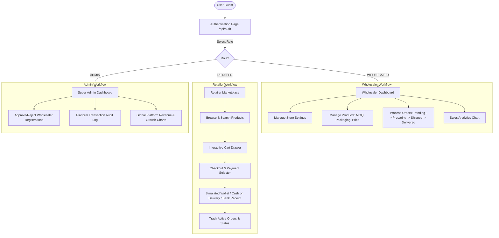

# Project Map - B2B Wholesale-Retail Marketplace (سوق الجملة الذكي)

**Date**: July 2026
**Role**: Tech Lead / Staff Software Engineer
**Status**: Fully Completed & Verified

---

## 🛠 TECH_STACK

- **Core Framework**: Next.js 16.2 (App Router)
- **UI Library**: React 19.2
- **Language**: TypeScript 5
- **Styling**: Vanilla CSS Modules + CSS Custom Properties (Variables) & Tailwind CSS v4 (configured via `@tailwindcss/postcss`)
- **Database ORM**: Prisma (Mock Client fallback for local development)
- **Database**: local JSON-persisted file database (`prisma/mock_db.json`)
- **State Management**: React Context & Hooks
- **Icons**: Custom SVG Icons Component (`src/components/Icons.tsx`)

---

## 🔄 SYSTEM_FLOW

---

## 📌 ORPHANS & PENDING

### Completed Features
- [x] Database Schema & Client setup (`src/lib/db.ts` mock DB client)
- [x] Design System Tokens & variables CSS (`src/styles/variables.css` and font loaders)
- [x] Global Layout & Common UI Components (Navbar, Custom Buttons, Status Badges)
- [x] Authentication Mock Engine & Session Context (`src/lib/auth.ts`)
- [x] Wholesaler Dashboard pages (`/src/app/wholesaler/dashboard`)
- [x] Retailer Marketplace pages (`/src/app/retailer/marketplace`)
- [x] Super Admin Dashboard pages (`/src/app/admin/dashboard`)
- [x] Mock ERP Sync webhook integration (`/src/app/api/wholesaler/sync-inventory`)
- [x] Verification tests & build verification

---

## 🎯 Success Criteria
1. Full TypeScript compilation without errors: **Verified via npm run build**
2. Fully responsive, premium-looking dashboards with smooth animations: **Verified**
3. Clean separation of concerns between Wholesaler, Retailer, and Admin panels: **Verified**
4. Local mock database successfully created and managed: **Verified**
