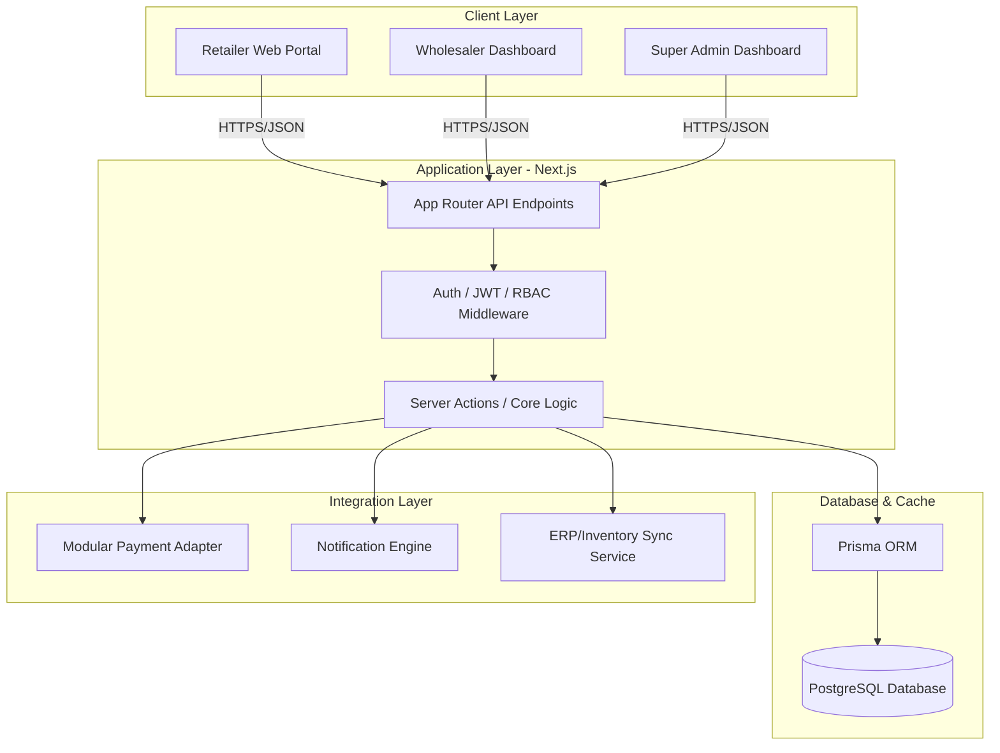

# B2B Wholesale-Retail Marketplace (سوق الجملة الذكي)

A premium, enterprise-grade B2B e-commerce platform designed to connect wholesale merchants (تجار الجملة) directly with retail shop owners (أصحاب البقالات والتجزئة). The platform is designed for security, extreme speed, reliability, and modern UI/UX with smooth animations.

---

## User Review Required

> [!IMPORTANT]
> **Key Architectural Decisions & Requirements:**
> 1. **Tech Stack**: Next.js (App Router) + TypeScript + Prisma ORM (PostgreSQL) is proposed for an all-in-one high-performance, SEO-friendly framework.
> 2. **Styling**: Modern Vanilla CSS (using CSS Modules and CSS Variables) will be used to build a bespoke, premium design system without heavy frameworks like Tailwind CSS, unless specified.
> 3. **Role-Based Workflows**: Three distinct roles will be supported:
>    - **Wholesaler (تاجر الجملة)**: Manage stores, inventory, prices, orders, and view sales dashboards.
>    - **Retailer (صاحب التجزئة)**: Browse products, filter by category/wholesaler, place orders, make payments, and track orders.
>    - **Super Admin (المدير العام)**: Approve wholesale store registrations, manage global platform fees, resolve disputes, and analyze platform-wide growth.
> 4. **B2B Focus**: No public consumer access. All retailers and wholesalers must sign up and be approved (wholesalers specifically by Super Admin) to trade.

---

## Open Questions

> [!NOTE]
> 1. **Inventory Integration (ERP/API)**: Should we implement a standard JSON webhook/REST API for wholesalers to sync automatically with their external inventory systems (e.g., Al-Ameen, YemenSoft, Odoo)?
> 2. **Target Currency**: Should the platform support multiple currencies (e.g., Yemeni Rial, Saudi Rial, US Dollar) or a single currency by default?
> 3. **Electronic Wallets**: Should we build a modular mock wallet simulation for demonstration (e.g., Kuraimi Bank, Jawal Pay, M-Floos) which can easily be replaced by real APIs later?

---

## Proposed System Architecture

---

## Proposed Changes

### Database Schema (Prisma)

#### [NEW] [schema.prisma](file:///d:/My%20Project/Antigravity/Wholesale_Stores/prisma/schema.prisma)
Create the database schema including:
- `User`: Handles credentials, roles (`ADMIN`, `WHOLESALER`, `RETAILER`), verification status, and contact details.
- `Store`: Represents a wholesaler's digital storefront, with settings, branding, and status.
- `Product`: Standard B2B product structure including code, description, packing unit (e.g., box, carton, piece), minimum order quantity (MOQ), wholesale prices (tiered pricing support), available stock, and images.
- `Category`: Hierarchy of product categories (e.g., Canned Food, Beverages, Detergents).
- `Order` & `OrderItem`: Orders placed by retailers, detailing order status (`PENDING`, `ACCEPTED`, `PREPARING`, `SHIPPED`, `DELIVERED`, `CANCELLED`), delivery fees, and items purchased.
- `Transaction`: Multi-method financial log recording payment status (`PENDING`, `APPROVED`, `REJECTED`, `COMPLETED`), transaction references (wallets, bank receipts, codes), and cash on delivery statements.
- `InventorySyncLog`: Tracking automated stock updates via external ERP systems.

### Project Structure & Frontend Components

We will organize the project inside a Next.js workspace structure:
- `/src/app`: Page routing, layouts, and API routes.
- `/src/components`: Reusable, modular Vanilla CSS components.
- `/src/styles`: CSS variables, animations, custom layout utilities, global CSS.
- `/src/lib`: Database client (Prisma), utility helper functions, auth middleware, payment handlers.

#### [NEW] [variables.css](file:///d:/My%20Project/Antigravity/Wholesale_Stores/src/styles/variables.css)
Establish a design system using Vanilla CSS custom variables:
- Curated color palettes (deep rich primary blues, premium slate/indigo dashboard backgrounds, vibrant accent golds for transactions).
- Modern typography rules (using clean fonts, perfect sizing scales).
- Smooth transition timings for premium micro-animations (buttons, card hover effects, checkout slides).

#### [NEW] [wholesaler-dashboard](file:///d:/My%20Project/Antigravity/Wholesale_Stores/src/app/wholesaler/dashboard/page.tsx)
Create a comprehensive workspace for the Wholesaler including:
- Quick statistics cards (revenue, active orders, out-of-stock count).
- Interactive inventory manager (add/edit products, toggle stock, upload pictures).
- Order processing panel (accept/reject incoming retailer orders with live status updates).
- Dynamic sales chart (SVG-based smooth lines to avoid heavy external charting libraries).

#### [NEW] [retailer-marketplace](file:///d:/My%20Project/Antigravity/Wholesale_Stores/src/app/retailer/marketplace/page.tsx)
Build a marketplace client for the Retailer:
- Categories sliding bar.
- Fast fuzzy search for products.
- Product grid listing wholesale details (MOQ, unit price, stock levels).
- Interactive Cart drawer showing running totals, packaging breakdown, and weight.
- Checkout system with dynamic payment options selector.

#### [NEW] [super-admin](file:///d:/My%20Project/Antigravity/Wholesale_Stores/src/app/admin/dashboard/page.tsx)
Build an overall control dashboard:
- Merchant registration review queue (approve/reject stores).
- System-wide transaction audit log.
- Platform analytics (total volume, merchant performance, top-selling categories).

---

## Verification Plan

### Automated Tests
- Build verification using `npm run build`.
- API endpoint unit tests verifying authentication gates, role-based authorization, and order flow validation.

### Manual Verification
- Testing user registration and switching between Retailer and Wholesaler accounts.
- Simulating cart additions, checkout, payment method selection, and order flow from creation to final delivery.
- Verification of design responsive layout across mobile and desktop.
- Mocking a simulated ERP webhook inventory updates to test integration readiness.
